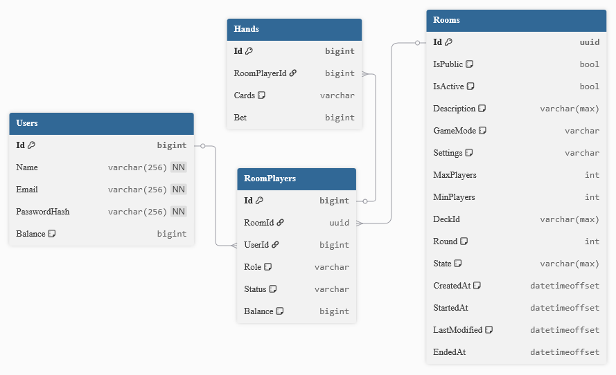
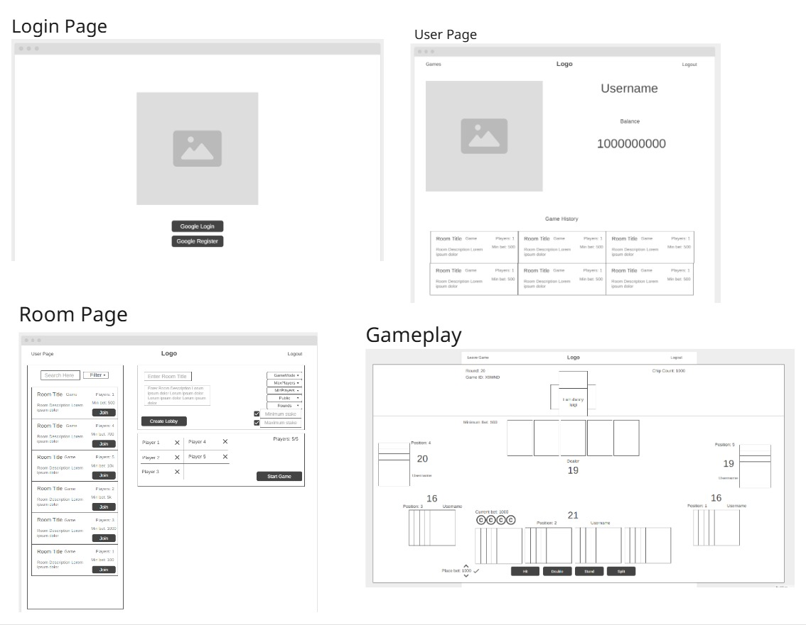

# Daunting-Devitos

## Syponsis
DeVito Lounge is a full-stack web application that brings the classic blackjack game to the web, featuring secure user accounts, real-time gameplay, and persistent data management. Players can join or create game rooms, place bets, and compete against a dealer, with future scalability to support multiplayer sessions. The system’s backend is powered by a RESTful Web API that handles user authentication, game state management, and balance tracking, while the frontend provides an intuitive interface for smooth and interactive gameplay. Built with scalability and modularity in mind, the project’s architecture allows easy expansion for additional features like leaderboards, chat, and multiplayer functionality.

## ✨ Features

🃏 Playable Blackjack Game – Fully functional game logic where players can hit, stand, and place bets against a dealer.

👤 User Accounts & Authentication – Secure registration and login system using Google-OAuth authentication.

💰 Balance Tracking – Each player’s balance is updated automatically after each round, win, or loss.

🏠 Game Rooms – Players can create or join rooms to start new blackjack sessions.

👥 Room Player Management – Each room tracks its active players, balances, and roles (dealer/player).

🪄 Deck API – Supports adding cards, creating hands, and updating bets dynamically via REST endpoints.

🔄 Scalable Architecture – Designed to expand into multiplayer support and multiple concurrent game rooms.

⚙️ RESTful API Design – Clean, structured endpoints for users, rooms, room players, and hands.

🧩 Modular Full-Stack Setup – Clear separation between frontend (React) and backend (ASP.NET Core API).

📈 Future-Ready Features – Built to support enhancements like leaderboards, chat, and multiplayer matchmaking.

## Entity Relationship Diagram (ERD)

## Wireframe Diagram

## Unit Test Coverage

## API Endpoints Documentation

All routes below are relative to this base.

## 👥 Users
| Method  | Endpoint         | Description                                    | Request Body / Params                                    | Return                                 |
| :------ | :--------------- | :--------------------------------------------- | :------------------------------------------------------- | :------------------------------------- |
| `GET`   | `/Auth/Login`    | Get user login                                 | **LoginDto** `{ email, password }`                    | **User** *(with authentication token)* |
| `POST`  | `/Auth/Register` | Create a new user account                      | **RegisterDto** `{ name, email, password }`           | **User**                               |
| `GET`   | `/`              | Get all users                                  | –                                                        | **List<User>**                         |
| `GET`   | `/{id}`          | Get a user by ID                               | `id` *(integer, path)*                                   | **User**                               |
| `PATCH` | `/{balance}`     | Update a user’s balance from the game          | `balance` *(decimal, path)*                              | **User** *(updated)*                   |
| `POST`  | `/`              | Create a user manually (admin or internal use) | **UserDto** `{ name, email, passwordHash, balance? }` | **User**                               |

## 🏠 Rooms
| Method  | Endpoint                   | Description                                     | Request Body / Params                                            | Return                         |
| :------ | :------------------------- | :---------------------------------------------- | :--------------------------------------------------------------- | :----------------------------- |
| `GET`   | `/Room`                    | Get all rooms                                   | –                                                                | **List<Room>**                 |
| `GET`   | `/Room/{id}`               | Get a room by ID                                | `id` *(Guid, path)*                                              | **Room**                       |
| `GET`   | `/Room/{roomId}`           | Get game state or configuration for a room      | `roomId` *(Guid, path)*                                          | **GameState** / **RoomConfig** |
| `GET`   | `/Room?type={gamemode}`    | Get rooms filtered by game mode                 | `type` *(string, query)*                                         | **List<Room>**                 |
| `GET`   | `/Room/{id}/MaxSize`       | Check if a room is at maximum player capacity   | `id` *(Guid, path)*                                              | **Boolean** *(true if full)*   |
| `POST`  | `/Room`                    | Start a new game lobby                          | **CreateRoomDto** `{ name, gameMode, maxPlayers, isPublic? }` | **Room**                       |
| `PATCH` | `/Room`                    | Update room settings (e.g., isActive, isPublic) | **UpdateRoomDto** `{ isActive?, isPublic? }`                  | **Room** *(updated)*           |
| `GET`   | `/Room/{id}/Deck/{deckId}` | Get deck information associated with a room     | `id`, `deckId` *(Guid, path)*                                    | **Deck**                       |

## 👥 RoomPlayers
| Method  | Endpoint                                  | Description                                                   | Request Body / Params                                       | Return                     |
| :------ | :---------------------------------------- | :------------------------------------------------------------ | :---------------------------------------------------------- | :------------------------- |
| `GET`   | `/RoomPlayer/{id}`                        | Get a specific room player by ID                              | `id` *(Guid, path)*                                         | **RoomPlayer**             |
| `GET`   | `/RoomPlayer/{id}/ViewAll`                | View all players in a specific room                           | `id` *(Guid, path)*                                         | **List<RoomPlayer>**       |
| `PATCH` | `/RoomPlayer/{id}/Balance/{addedBalance}` | Update a room player’s balance by adding or subtracting funds | `id`, `addedBalance` *(Guid, decimal, path)*                | **RoomPlayer** *(updated)* |
| `PUT`   | `/RoomPlayer/{id}`                        | Update a room player entity (e.g., status, isActive, role)    | **UpdateRoomPlayerDto** `{ isActive?, role?, balance? }` | **RoomPlayer** *(updated)* |
| `POST`  | `/Room/{roomId}/RoomPlayer`               | Add a player to a room                                        | **CreateRoomPlayerDto** `{ userId, roomId, balance? }`   | **RoomPlayer**             |

## 🃏 Hands
| Method   | Endpoint                              | Description                                             | Request Body / Params                          | Return               |
| :------- | :------------------------------------ | :------------------------------------------------------ | :--------------------------------------------- | :------------------- |
| `GET`    | `/rooms/{roomId}/hands`               | Get all hands in the current game (for a specific room) | `roomId` *(Guid, path)*                        | **List<Hand>**       |
| `GET`    | `/rooms/{roomId}/hands/{handId}`      | Get a selected hand by ID                               | `roomId`, `handId` *(Guid, path)*              | **Hand**             |
| `GET`    | `/rooms/{roomId}/hands/user/{userId}` | Get all hands belonging to a specific user in a room    | `roomId`, `userId` *(Guid, path)*              | **List<Hand>**       |
| `POST`   | `/rooms/{roomId}/hands`               | Create a new hand for a player                          | **CreateHandDto** `{ userId, bet, cards? }` | **Hand**             |
| `PATCH`  | `/rooms/{roomId}/hands/{handId}`      | Add a random card to the specified hand                 | `roomId`, `handId` *(Guid, path)*              | **Hand** *(updated)* |
| `PATCH`  | `/rooms/{roomId}/hands/{bet}`         | Update the player’s bet and adjust room player balance  | `roomId`, `bet` *(decimal, path)*              | **Hand** *(updated)* |
| `DELETE` | `/rooms/{roomId}/hands/{handId}`      | Delete a hand from the game                             | `roomId`, `handId` *(Guid, path)*              | –                    |
